<!-- You opened the source. Respect. Every image here is hand-built SVG from assets/build.py. Say hi: srinivasrc0408@gmail.com -->



  <a href="https://github.com/srinivas-rc0408/aegis"></a>
  <a href="https://github.com/srinivas-rc0408/codebase-migration-agent"></a>


  <a href="https://aqua-wheat.vercel.app"></a>
  <a href="https://github.com/srinivas-rc0408/archagent"></a>
  <a href="https://github.com/srinivas-rc0408/health-risk-mlops"></a>
  




<picture><source media="(prefers-color-scheme: dark)" srcset="./profile/snake-dark.svg" /><source media="(prefers-color-scheme: light)" srcset="./profile/snake-light.svg" /></picture>


  <a href="https://srinivas-rc.is-a.dev"></a>
  <a href="https://www.linkedin.com/in/srinivas-r-c-169406294"></a>
  <a href="mailto:srinivasrc0408@gmail.com"></a>
  <a href="https://steamcommunity.com/profiles/76561199545795989/"></a>

