<!-- You opened the source. Respect. Every image here is hand-built SVG from assets/build.py, in dark and light. Say hi: srinivasrc0408@gmail.com -->

<a href="https://srinivas-rc.is-a.dev"><picture><source media="(prefers-color-scheme: dark)" srcset="./assets/dark/hero.svg" /><source media="(prefers-color-scheme: light)" srcset="./assets/light/hero.svg" /></picture></a>

AI engineer intern at IIT Ropar (remote). Final-year B.Tech AI & ML at REVA University, Bengaluru. Open to 2027 AI/ML roles.

<picture><source media="(prefers-color-scheme: dark)" srcset="./assets/dark/h-now.svg" /><source media="(prefers-color-scheme: light)" srcset="./assets/light/h-now.svg" /></picture>

<picture><source media="(prefers-color-scheme: dark)" srcset="./assets/dark/card-ajrasakha.svg" /><source media="(prefers-color-scheme: light)" srcset="./assets/light/card-ajrasakha.svg" /></picture>

  <a href="https://github.com/srinivas-rc0408/aegis"><picture><source media="(prefers-color-scheme: dark)" srcset="./assets/dark/card-aegis.svg" /><source media="(prefers-color-scheme: light)" srcset="./assets/light/card-aegis.svg" /></picture></a>
  <a href="https://github.com/srinivas-rc0408/codebase-migration-agent"><picture><source media="(prefers-color-scheme: dark)" srcset="./assets/dark/card-migration.svg" /><source media="(prefers-color-scheme: light)" srcset="./assets/light/card-migration.svg" /></picture></a>

<picture><source media="(prefers-color-scheme: dark)" srcset="./assets/dark/h-shipped.svg" /><source media="(prefers-color-scheme: light)" srcset="./assets/light/h-shipped.svg" /></picture>

  <a href="https://aqua-wheat.vercel.app"><picture><source media="(prefers-color-scheme: dark)" srcset="./assets/dark/card-aquasentinel.svg" /><source media="(prefers-color-scheme: light)" srcset="./assets/light/card-aquasentinel.svg" /></picture></a>
  <a href="https://github.com/srinivas-rc0408/archagent"><picture><source media="(prefers-color-scheme: dark)" srcset="./assets/dark/card-archagent.svg" /><source media="(prefers-color-scheme: light)" srcset="./assets/light/card-archagent.svg" /></picture></a>
  <a href="https://github.com/srinivas-rc0408/health-risk-mlops"><picture><source media="(prefers-color-scheme: dark)" srcset="./assets/dark/card-mlops.svg" /><source media="(prefers-color-scheme: light)" srcset="./assets/light/card-mlops.svg" /></picture></a>
  <a href="https://github.com/srinivas-rc0408/debug-ext"><picture><source media="(prefers-color-scheme: dark)" srcset="./assets/dark/card-debugext.svg" /><source media="(prefers-color-scheme: light)" srcset="./assets/light/card-debugext.svg" /></picture></a>

The AquaSentinel card opens the live demo; code at <a href="https://github.com/srinivas-rc0408/aquasentinel">srinivas-rc0408/aquasentinel</a>. My <a href="https://srinivas-rc.is-a.dev">portfolio</a> has a RAG chatbot you can ask about me. My <a href="https://github.com/srinivas-rc0408/dotfiles">dotfiles</a> are the Arch + niri + fish setup behind all this.

<picture><source media="(prefers-color-scheme: dark)" srcset="./assets/dark/h-stack.svg" /><source media="(prefers-color-scheme: light)" srcset="./assets/light/h-stack.svg" /></picture>

<picture><source media="(prefers-color-scheme: dark)" srcset="./assets/dark/stack.svg" /><source media="(prefers-color-scheme: light)" srcset="./assets/light/stack.svg" /></picture>

<picture><source media="(prefers-color-scheme: dark)" srcset="./assets/dark/h-activity.svg" /><source media="(prefers-color-scheme: light)" srcset="./assets/light/h-activity.svg" /></picture>

<picture><source media="(prefers-color-scheme: dark)" srcset="./profile/snake-dark.svg" /><source media="(prefers-color-scheme: light)" srcset="./profile/snake-light.svg" /></picture>

<picture><source media="(prefers-color-scheme: dark)" srcset="./assets/dark/h-contact.svg" /><source media="(prefers-color-scheme: light)" srcset="./assets/light/h-contact.svg" /></picture>

  <a href="https://srinivas-rc.is-a.dev"><picture><source media="(prefers-color-scheme: dark)" srcset="./assets/dark/btn-portfolio.svg" /><source media="(prefers-color-scheme: light)" srcset="./assets/light/btn-portfolio.svg" /></picture></a>
  <a href="https://www.linkedin.com/in/srinivas-r-c-169406294"><picture><source media="(prefers-color-scheme: dark)" srcset="./assets/dark/btn-linkedin.svg" /><source media="(prefers-color-scheme: light)" srcset="./assets/light/btn-linkedin.svg" /></picture></a>
  <a href="mailto:srinivasrc0408@gmail.com"><picture><source media="(prefers-color-scheme: dark)" srcset="./assets/dark/btn-email.svg" /><source media="(prefers-color-scheme: light)" srcset="./assets/light/btn-email.svg" /></picture></a>
  <a href="https://steamcommunity.com/profiles/76561199545795989/"><picture><source media="(prefers-color-scheme: dark)" srcset="./assets/dark/btn-steam.svg" /><source media="(prefers-color-scheme: light)" srcset="./assets/light/btn-steam.svg" /></picture></a>

<picture><source media="(prefers-color-scheme: dark)" srcset="./assets/dark/footer.svg" /><source media="(prefers-color-scheme: light)" srcset="./assets/light/footer.svg" /></picture>
