<!-- You opened the source. Respect. Say hi: srinivasrc0408@gmail.com -->

I build AI systems for places the cloud can't reach: air-gapped industrial sites, and a laptop with 4 GB of VRAM.

Final-year B.Tech AI & ML student at REVA University, Bengaluru. Open to AI/ML and SDE internships and 2027 full-time roles.

## ~/now

**[AEGIS](https://github.com/srinivas-rc0408/aegis)** — Air-Gapped Engineering Intelligence System  
An offline agentic AI workbench for confidential industrial work at Mangalore Refinery (MRPL), built for Smart India Hackathon 2026, problem statement SIH26117. A LangGraph ReAct loop plans the task, inspects images with moondream2, retrieves from internal documents through FAISS, runs calculations in a sandboxed Python runtime inside Docker, then audits its own answer. Reasoning runs on Qwen2.5-7B through Ollama, on a 4 GB laptop GPU. No data leaves the machine.  
`LangGraph` `Ollama` `Qwen2.5-7B` `moondream2` `FAISS` `FastAPI` `Docker` `Streamlit`

**[Codebase Migration Agent](https://github.com/srinivas-rc0408/codebase-migration-agent)** — internship project, REVA Center for AI & ML  
An LLM agent that upgrades an entire codebase across breaking version changes. It reads the code through AST and static analysis, orders edits with a dependency graph, and works in a plan → edit → test → self-correct loop inside a Docker sandbox. Deliverables: the agent, a migration patch, audit logs, a benchmark report, and a research paper.  
`Python` `AST` `LLM agents` `Docker`

## ~/shipped

**[AquaSentinel](https://github.com/srinivas-rc0408/aquasentinel)** · [live demo](https://aqua-wheat.vercel.app)  
Mission control for an autonomous underwater inspection robot: live sensor telemetry, robot health, camera control, a waypoint route planner, AI image defect detection, and PDF inspection reports. Designed from a 13-document engineering spec (PRD, API contract, DB schema, security spec, 40+ tickets) before a line of code was written.  
`React 19` `Vite` `TypeScript` `Express` `Postgres (Neon)`

**[ArchAgent](https://github.com/srinivas-rc0408/archagent)**  
Turns a plain-language building brief into 3D panoramic renders and an itemised cost estimate in under 60 seconds. A multi-stage Gemini pipeline; few-shot price anchors in INR stopped the cost estimator from hallucinating numbers.  
`React` `TypeScript` `Gemini API`

**[health-risk-mlops](https://github.com/srinivas-rc0408/health-risk-mlops)**  
A health-risk prediction model taken all the way to production shape: served by FastAPI, packaged in Docker, experiments tracked in MLflow, tested and shipped by GitHub Actions.  
`FastAPI` `Docker` `MLflow` `GitHub Actions`

**[Debug.ext](https://github.com/srinivas-rc0408/debug-ext)**  
A Chrome extension that catches runtime errors, failed network requests, and log files, sorts each into one of five classes with a P0–P3 priority, and drafts a fix. FastAPI and SQLite behind it, a Streamlit dashboard and PDF reports in front.  
`Chrome MV3` `FastAPI` `SQLite` `Streamlit`

More: my [portfolio](https://srinivas-rc.is-a.dev) has a RAG chatbot you can ask about me, and my [dotfiles](https://github.com/srinivas-rc0408/dotfiles) are the Arch + niri + fish setup this page is drawn from.

## ~/stack

| | |
|---|---|
| **LLM systems** | LangGraph, Ollama, FAISS, ChromaDB, sentence-transformers, Gemini API |
| **ML + MLOps** | Python, NumPy, MLflow, Docker, GitHub Actions |
| **Backend** | FastAPI, Express, PostgreSQL (Neon), SQLite |
| **Frontend** | TypeScript, React, Next.js, Vite, Streamlit |
| **Systems** | Arch Linux, Bash, fish, Git, C++ |

## ~/activity

  
  

<picture>
  <source media="(prefers-color-scheme: dark)" srcset="./profile/snake-dark.svg" />
  <source media="(prefers-color-scheme: light)" srcset="./profile/snake-light.svg" />
  
</picture>

## ~/contact

<code>srinivas@s10 ~&gt; exit</code>
